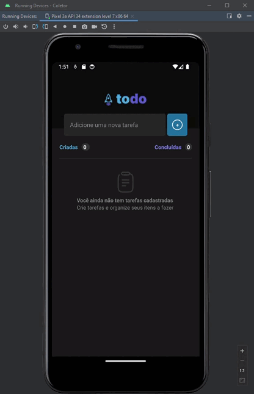

# 🚀 ToDo List

## 📋 Descrição

ToDo List é uma aplicação mobile de criação e controle de tarefas.
Esse projeto é um dos desafios da trilha de React Native do Ignite.

## ☘️ Funcionalidades
 
- **Adicionar Tarefas**: Insira uma nova tarefa no campo de input.
- **Remover Tarefas**: Se uma tarefa precisar ser removida, basta clicar no botão de exclusão.
- **Concluir Tarefas**: Se uma tarefa foi concluida, basta clicar no chekbox dela.
- **Contador de Tarefas Concluidas**: Acompanhe pelo contador o total de tarefas foram concluidas.
- **Contador de Tarefas Cridas**: Acompanhe pelo contador o total de tarefas foram criadas.

## 💻 Tecnologias utilizadas

 **React Native**: Framework usado para desenvolver a interface mobile da aplicação.
- **JavaScript**: Linguagem de programação utilizada no desenvolvimento.
- **TypeScript**: Utilizado para validações e tipagem no código.
- **Expo**: Plataforma usada para facilitar o desenvolvimento e a execução da aplicação mobile.

## 🛠️ Instalando e Rodando

1. Clone o sistema para seu ambiente com: `git@github.com:hi-giih/ToDo-List.git`

2. Em seu ambiente, entre na pasta do projeto `cd ToDoList`

3. Instale todas as dependências do projeto com: `npm install`

4. Inicialize a aplicação em ambiente de desenvolvimento através do comando `expo start`

6. Pronto! O sistema estará rodando, você pode utilizar o Expo Go no seu celular para rodar a aplicação localmente caso não tenha um simulador

## 📌 Futuras Melhorias

- **Excluir tarefas concluidas**: Adicionar a opção de remover tarefas já concluídas da lista. Atualmente, o contador de tarefas concluídas não é atualizado após a exclusão dessas tarefas, e esse comportamento será ajustado para refletir corretamente o número de tarefas finalizadas.

- **Adicionar datas as tarefas**  Implementar um campo de data para cada tarefa, permitindo que os usuários visualizem e organizem as tarefas conforme suas datas de criação ou prazos.

## 📫 Exemplo de Uso

## 📜 Licença 

Este projeto não está sob nenhuma licença.
